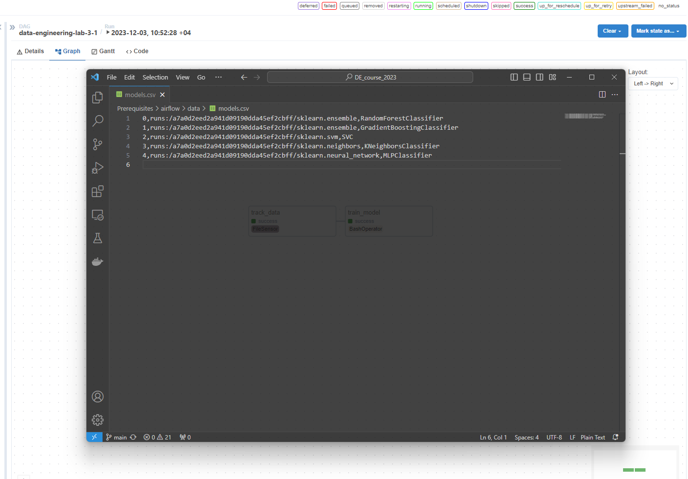
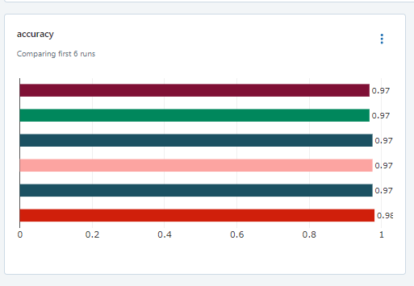

# Лабораторная работа №3 (Кашапов А.И., гр. 6231)

## Airflow и MLflow - логгирование экспериментов и версионирование моделей

В рамках данной лабораторной работы были построены два пайплайна:

1. Пайплайн, который обучает любой классификатор из sklearn по заданному набору параметров.
2. Пайплайн, который выбирает лучшую модель из обученных и производит её хостинг.

Для построения такого пайплайна использовался Apache Airflow и MLflow.

## Пайплайн для обучения классификаторов

Построенный пайплайн выполняет следующие действия поочередно:

1. Производить мониторинг целевой папки на предмет появления новых конфигурационных файлов классификаторов в формате .json.
2. Обучать классификатор в соответствии с полученными параметрами.
   1. Производить логгирование параметров модели в MLflow.
   2. Производить логгирование процесса обучения MLflow.
   3. Производить тестирование модели и сохранять его результаты в MLflow.
3. Сохранять обученный классификатор в model registry MLflow.

Разработанный DAG:

```
import os
from datetime import datetime

from airflow import DAG
from airflow.operators.bash_operator import BashOperator
from airflow.sensors.filesystem import FileSensor

os.environ["AWS_ACCESS_KEY_ID"] = "minio"
os.environ["AWS_SECRET_ACCESS_KEY"] = "minio123"
os.environ["MLFLOW_S3_ENDPOINT_URL"] = "http://minio:9000"

default_args = {
    'owner': 'airflow',
    'start_date': datetime(2023, 1, 1),
    'retries': 1,
}

dag = DAG(
    dag_id='data-engineering-lab-3-1',
    default_args=default_args,
    description='DAG for data engineering lab 3: training a scikit-learn model',
    schedule_interval=None,
)

track_data = FileSensor(
    task_id='track_data',
    poke_interval=10,
    filepath='/opt/airflow/data/model.json',
    fs_conn_id='filesensor',
    dag=dag,
)

train_model = BashOperator(
    task_id="train_model",
    bash_command="python /opt/airflow/data/train.py",
    dag=dag
)

track_data >> train_model


```

Основной скрипт `train.py`:

```
import importlib
import json

import mlflow
import mlflow.sklearn
import pandas as pd
from mlflow.models import infer_signature
from sklearn.datasets import load_digits
from sklearn.metrics import accuracy_score
from sklearn.model_selection import train_test_split
from sklearn.preprocessing import StandardScaler


if __name__=="__main__":

    with open('/opt/airflow/data/model.json') as f:
        model_params = json.load(f)

    digits = load_digits()
    X = digits.data
    y = digits.target
    X_train, X_test, y_train, y_test = train_test_split(X, y, test_size=0.2, random_state=42)

    scaler = StandardScaler()
    X_train = scaler.fit_transform(X_train)
    X_test = scaler.transform(X_test)

    mlflow.set_tracking_uri('http://mlflow_server:5000')

    with mlflow.start_run() as run:
        for i, data in enumerate(model_params):
            lib = importlib.import_module(data['source'])
            classifier = getattr(lib, data['classifier'])
            model = classifier(**data['kwargs'])
            model.fit(X_train, y_train)
            prediction = model.predict(X_test)
            signature = infer_signature(X_test, prediction)

            mlflow.log_params(data['kwargs'])
            mlflow.log_metrics({"accuracy": accuracy_score(y_test, prediction)})

            model_info = mlflow.sklearn.log_model(
                sk_model=model,
                artifact_path=data['source'],
                signature=signature,
                registered_model_name=data['classifier']
            )

            df = pd.DataFrame({
                "uri": model_info.model_uri,
                "name": data['classifier']
            }, index=[i])
            df.to_csv('/opt/airflow/data/models.csv', mode='a', header=False)

```

## Пайплайн для хостинга лучшей модейли

Построенный пайплайн будет выполнять следующие действия:

1. В соответствии с таймером производит валидацию новых моделей из model registry.
2. Модель с лучшим показателем метрики переводится на stage: Production
3. (Опционально) произвести хостинг лучшей модели

Разработанный DAG:

```
import os
from datetime import datetime

from airflow import DAG
from airflow.operators.bash_operator import BashOperator

os.environ["AWS_ACCESS_KEY_ID"] = "minio"
os.environ["AWS_SECRET_ACCESS_KEY"] = "minio123"
os.environ["MLFLOW_S3_ENDPOINT_URL"] = "http://minio:9000"

default_args = {
    'owner': 'airflow',
    'start_date': datetime(2023, 1, 1),
    'retries': 1,
}

dag = DAG(
    dag_id='data-engineering-lab-3-2',
    default_args=default_args,
    description='DAG for data engineering lab 3: hosting the best scikit-learn model',
)

validate_model = BashOperator(
    task_id="validate_model",
    bash_command="python /opt/airflow/data/host.py",
    dag=dag
)

validate_model

```

Основной скрипт `host.py`:

```
import mlflow
import mlflow.sklearn
import pandas as pd
from mlflow import MlflowClient
from sklearn.datasets import load_digits
from sklearn.metrics import accuracy_score
from sklearn.model_selection import train_test_split
from sklearn.preprocessing import StandardScaler


if __name__=="__main__":
    mlflow.set_tracking_uri('http://mlflow_server:5000')

    digits = load_digits()
    X = digits.data
    y = digits.target
    X_train, X_test, y_train, y_test = train_test_split(X, y, test_size=0.2, random_state=42)

    scaler = StandardScaler()
    X_train = scaler.fit_transform(X_train)
    X_test = scaler.transform(X_test)

    models = []

    with mlflow.start_run() as run:
        models_file = pd.read_csv("/opt/airflow/data/models.csv", header=None)
        for model_Info in models_file.iterrows():
            model_uri = model_Info[1][1]
            model_name = model_Info[1][2]
            models.append(
                {
                    'model_uri': model_uri,
                    'model_name': model_name,
                    'model': mlflow.sklearn.load_model(model_uri)
                }
            )

        results = []
        for el in models:
            res = el['model'].predict(X_test)
            results.append(
                {
                    'model_uri': el['model_uri'],
                    'model_name': el['model_name'],
                    'res': accuracy_score(y_test, res)
                }
            )
        
        best_result = max(results, key=lambda x: x['res'])

        client = MlflowClient()
        result = client.search_model_versions(f'name="{best_result["model_name"]}" and run_id="{best_result["model_uri"]}"')[0]
        client.transition_model_version_stage(name=best_result["model_name"], version=result.version, stage="Production")

```

Также были сохранены фрагменты интерфейса в процессе выполнения работы:




